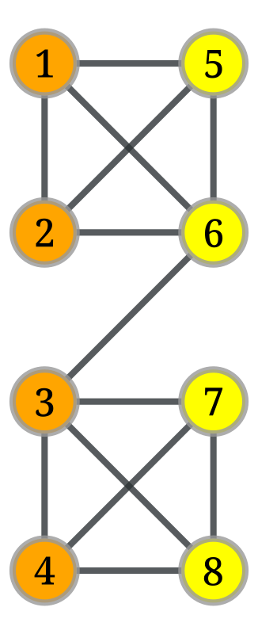
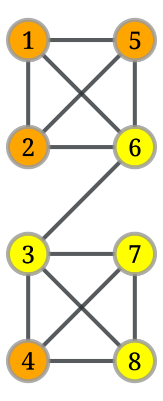
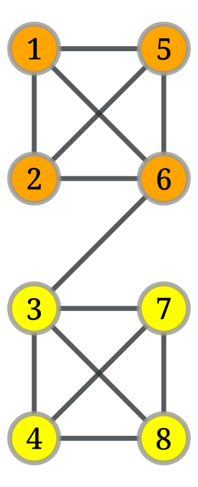
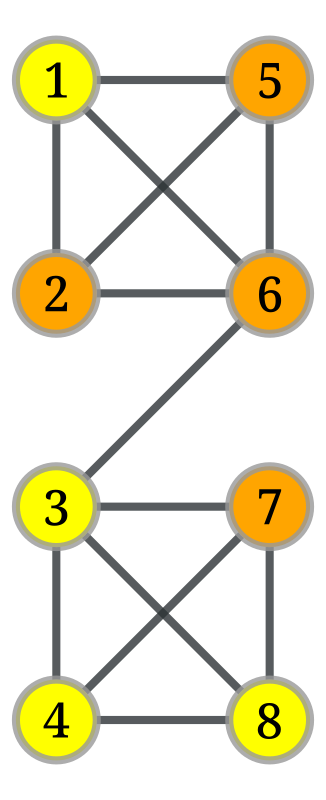
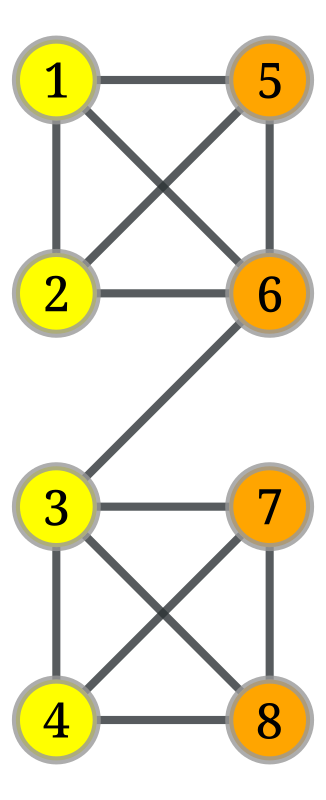

# Assignment 4


<!-- WARNING: THIS FILE WAS AUTOGENERATED! DO NOT EDIT! -->

## Exercise 1

(2 points)

- Execute the Kernighan-Lin partitioning variant as given in the lecture
  in the following network, where the starting partitions are given by
  the colours.
- Try to find a starting partition that changes the outcome. Either
  provide it with the changed outcome or try to explain why it is not
  possible.



**To provide a solution to the exercise:** Provide the D values for each
step and the maximum gain for the selection of the swap. Indicate the
change of partitions from the swaps (preferred: visually), including the
selected nodes, as well as the fixed nodes in each step. List the cut
costs for each step and the selected prefix of swaps, too. Provide a
starting partition or argument.

**Given:** A graph with 2*n* nodes where each node has the same
weight.  
**Goal:** A partition of the graph into two disjoint subsets *A* and *B*
with minimum cut cost and |*A*| = |*B*| = *n*.  
The example has *n* = 4

We define the reduction in cost for when two elements *a* ∈ *A* and
*b* ∈ *B* are interchanged as
*g*<sub>*a**b*</sub> = *D*<sub>*a*</sub> + *D*<sub>*b*</sub> − 2*c*<sub>*a**b*</sub>
and the cost reduction for moving *a*:
*D*<sub>*a*</sub> = *k*<sub>*a*</sub><sup>*e**x**t*</sup> − *k*<sub>*a*</sub><sup>*i**n**t*</sup>.

**For the start we can define:**  
Cut cost: 9  
Not fixed: 1, 2, 3, 4, 5, 6, 7, 8  
Benefit *D*<sub>*v*</sub> of each node:

``` python
d = {
    1: 1,
    2: 1,
    3: 2,
    4: 1,
    5: 1,
    6: 2,
    7: 1,
    8: 1,
}
```

Now we need to compute the gains for all possible swaps and look for the
maximum gain swap:

For that we also define *c*<sub>*i**j*</sub> as the cost of links
between *i* and *j* (double counted in the *D*s but don’t provide gain)

``` python
# Connection checker (returns 1 if connected, else 0)
def c(i, j):
    vi, vj = g.vertex(i - 1), g.vertex(j - 1)  # 1-based to 0-based for graph_tool
    return 1 if g.edge(vi, vj) or g.edge(vj, vi) else 0

def gain(i, j, d):
    return d[i] + d[j] - 2 * c(i, j)

def compute_gains(d):
    g = {}
    for i in range(1, 5):
        for j in range(5, 9):
            g[(i, j)] = gain(i, j, d)
    return g
```

``` python
gains = compute_gains(d)
gains
```

    {(1, 5): 0,
     (1, 6): 1,
     (1, 7): 2,
     (1, 8): 2,
     (2, 5): 0,
     (2, 6): 1,
     (2, 7): 2,
     (2, 8): 2,
     (3, 5): 3,
     (3, 6): 2,
     (3, 7): 1,
     (3, 8): 1,
     (4, 5): 2,
     (4, 6): 3,
     (4, 7): 0,
     (4, 8): 0}

``` python
def compute_max_gain(gains):
    mx_gain = min(gains.values())
    mx_gain_index = Tuple
    for i in range(1, 5):
        for j in range(5, 9):
            if gains[(i,j)]> mx_gain:
                mx_gain = gains[(i,j)]
                mx_gain_index = (i, j)
    print (f"maximum gain: {mx_gain}, nodes to swap: {mx_gain_index}")

    return mx_gain, mx_gain_index
```

``` python
max_gain, max_gain_index = compute_max_gain(gains)
```

    maximum gain: 3, nodes to swap: (3, 5)

Now we choose nodes (3, 5) for swapping and fix them, though we could
also swap (4, 6).

``` python
def swap_nodes(i, j):
    # Swap nodes 3 and 5
    A.remove(i)
    B.remove(j)
    A.add(j)
    B.add(i)

    # Update vertex colors
    for i in range(1, 9):
        if i in A:
            fill_color[g.vertex(i - 1)] = "orange"
        else:
            fill_color[g.vertex(i - 1)] = "yellow"

    # Draw updated graph
    graph_draw(
        g, pos=pos, vertex_fill_color=fill_color,
        vertex_text=labels, output_size=(400, 400)
    )
```

``` python
swap_nodes(max_gain_index[0], max_gain_index[1])
```



Cut cost: 6  
Not fixed: 1, 2, 4, 6, 7, 8  
New *D*′<sub>*v*</sub>-values of each node is computed as
*D*′<sub>*x*</sub> = *D*<sub>*x*</sub> + 2*c*<sub>*x**a*</sub> − 2*c*<sub>*x**b*</sub>, ∀*x* ∈ *A* − {*a*}
*D*′<sub>*y*</sub> = *D*<sub>*y*</sub> + 2*c*<sub>*y**b*</sub> − 2*c*<sub>*y**a*</sub>, ∀*y* ∈ *B* − {*b*}

``` python
def new_d(x, a, b):
    return d[x] + 2*c(x, a) - 2*c(x, b)
```

``` python
d_new = {
    1: new_d(1, 3, 5),
    2: new_d(2, 3, 5),
    3: -1000,
    4: new_d(4, 3, 5),
    5: -1000,
    6: new_d(6, 5, 3),
    7: new_d(7, 5, 3),
    8: new_d(8, 5, 3),
}
d_new
```

    {1: -1, 2: -1, 3: -1000, 4: 3, 5: -1000, 6: 2, 7: -1, 8: -1}

``` python
gains = compute_gains(d_new)
gains
```

    {(1, 5): -1003,
     (1, 6): -1,
     (1, 7): -2,
     (1, 8): -2,
     (2, 5): -1003,
     (2, 6): -1,
     (2, 7): -2,
     (2, 8): -2,
     (3, 5): -2000,
     (3, 6): -1000,
     (3, 7): -1003,
     (3, 8): -1003,
     (4, 5): -997,
     (4, 6): 5,
     (4, 7): 0,
     (4, 8): 0}

``` python
max_gain, max_gain_index = compute_max_gain(gains)
```

    maximum gain: 5, nodes to swap: (4, 6)

``` python
swap_nodes(max_gain_index[0], max_gain_index[1])
```



``` python
d_new_new = {
    1: new_d(1, 4, 6),
    2: new_d(2, 4, 6),
    3: -1000,
    4: -1000,
    5: -1000,
    6: -1000,
    7: new_d(7, 6, 4),
    8: new_d(8, 6, 4),
}
print(d_new_new)
gains = compute_gains(d_new_new)
print(gains)
max_gain, max_gain_index = compute_max_gain(gains)
```

    {1: -1, 2: -1, 3: -1000, 4: -1000, 5: -1000, 6: -1000, 7: -1, 8: -1}
    {(1, 5): -1003, (1, 6): -1003, (1, 7): -2, (1, 8): -2, (2, 5): -1003, (2, 6): -1003, (2, 7): -2, (2, 8): -2, (3, 5): -2000, (3, 6): -2002, (3, 7): -1003, (3, 8): -1003, (4, 5): -2000, (4, 6): -2000, (4, 7): -1003, (4, 8): -1003}
    maximum gain: -2, nodes to swap: (1, 7)

``` python
swap_nodes(max_gain_index[0], max_gain_index[1])
```



``` python
d_new_new_new = {
    1: -1000,
    2: new_d(2, 4, 6),
    3: -1000,
    4: -1000,
    5: -1000,
    6: -1000,
    7: -1000,
    8: new_d(8, 6, 4),
}
print(d_new_new_new)
gains = compute_gains(d_new_new_new)
print(gains)
max_gain, max_gain_index = compute_max_gain(gains)
```

    {1: -1000, 2: -1, 3: -1000, 4: -1000, 5: -1000, 6: -1000, 7: -1000, 8: -1}
    {(1, 5): -2002, (1, 6): -2002, (1, 7): -2000, (1, 8): -1001, (2, 5): -1003, (2, 6): -1003, (2, 7): -1001, (2, 8): -2, (3, 5): -2000, (3, 6): -2002, (3, 7): -2002, (3, 8): -1003, (4, 5): -2000, (4, 6): -2000, (4, 7): -2002, (4, 8): -1003}
    maximum gain: -2, nodes to swap: (2, 8)

``` python
swap_nodes(max_gain_index[0], max_gain_index[1])
```



Hier muss man jetzt noch evaluieren wo man den besten gain hatte. Also
eigentlich nur nachsehen wo die cut-size am niedrigsten war.

#### How is the Kernighan-Lin partitioning variant described in the lecture?

There is something about starting partitions given as colors. So
probably we already have a preselection and we are now only optimizing
this selection to get a better fit for the network.

Finding a starting partition that changes the outcome, so select
different colors that then result in a different partition just because
of this starting set.

What do i actually need to do in practice? So how do i actually produce
valid results? Sounds like a lot of text, some numbers and essentially
following through a set of predefined steps and reporting these metrics
and my reasoning at each step.

*D* Values

There are multiple steps as it seems in Kernighan-Lin

Maximum Gain for the selection of the swap - whatever this means

Change of partitions from the swaps -\> visually (so draw a picture)

selected nodes

fixed nodes in each step

List cut costs for each step

Selected prefix of swaps

Starting partition and argument

The argument is obviously that no matter which starting arrangement is
chosen you will always arrive at the optimal solution since you try out
every possibility. The only version i could think of is one that
basically lures a first swap that makes the optimal set impossible in
the beginning and since these nodes are already locked in the beginning
the optimal solution of cut size 1 can never be reached. This could be a
possibility that we can look into for finding. But nonetheless it is
otherwise very unlikely with this algorithm.

The required solution is exactly what is demonstrated in this
[Video](https://www.youtube.com/watch?v=GsMZYDBFJv4&t=1429s)

## Exercise 2 Modularity

(3 points) \* Experiment with modularity optimisation in your favorite
software. Calculate modularity values (e.g. in networkx) for the
“non-intuitive” example networks given in the lecture. \* Optimise
modularity for the following graph consisting of a ring of same-size
cliques and neighbouring cliques connected via a single link. Determine
the modularity of a clustering in which each clique is its own cluster,
and of the clustering where two neighbouring cliques are forming a
cluster. \* Proof that a clustering with optimal modularity has no
cluster with a single node of degree 1. \* Extra(not mandatory): Given a
line graph, a path of N nodes. Show that if we divide the network into
two parts by cutting a line, with r and N-r nodes each part, then the
modularity is
$$\frac{3 − 4𝑛 + 4𝑟𝑛 − 4𝑟^2}{2(𝑛 − 1)^2}$$
Hence show that if N is even, the optimal division for modularity is
splitting the graph exactly in the middle.

**To provide a solution to the exercise:** Provide the modularity values
(a), the best modularity optimising community structure you can find (b)
drawing, argument, and the proof(s).

This Exercise is already part of the community detection section. So
Lecture 7 essentially. I first need to get that into my head before i
can tackle that. ’

## Exercise 3

(2 points) \* Consider the following small network To provide a solution
to the exercise: Calculate for each of the 10 pairs of nodes the cosine
similarity. Based on the values, construct the dendrogram for the
single-linkage hierarchical clustering of the network.

Ok the exercise is about hierarchical clustering

Clustering is also part of lecture 7 and comes after community
detection. Clustering just has this special goal of having a similarity
metric. So you are not just looking for communities based on minimizing
the cut size between the communities and basically having this as your
similarity metric. But you could have an arbitrary similarity metric
that can also have to do with some of the additional data contained in
the nodes. So this clustering is also something that is done in normal
data analysis where you just have structured data. So graph clustering
is like this but with the additional Network structure on top.

## Exercise 4

(3 points) Clustering

Execute partitioning/community detection/clustering on two networks of
your chosing (but with more than 100 nodes).

See for example for networkx the documentation on communities to find
supported methods, but feel free to use a different tool or framework
(note that Leiden and Louvain are implemented).

1)  Apply a partitioning / community detection method on your networks.

2)  Apply a hierarchical clustering on your networks.

3)  Draw the networks with the partitions / communities mapped to visual
    variables (e.g. color). Report the images and shortly discuss if you
    think the results can be improved.

4)  Draw the dendrogram from the hierarchical clustering and report it.

5)  Find a level in the dendrogram that you consider a good clustering.
    Report it and shortly explain why it is better than the others.
