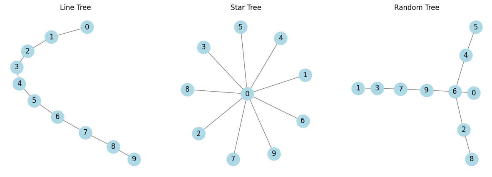

# Lecture 06


<!-- WARNING: THIS FILE WAS AUTOGENERATED! DO NOT EDIT! -->

## Imports

We are using `networkx` but `graphtools` is faster so we try this later.
Graph tool uses matrices instead of objects, so it uses 0 indexing with
makes some of the things you would do vor visualizing and sparse graphs
a bit stupid. But for general graph work it think it works very well. It
also doesn’t have all the different types of algorithms implemented with
their scientific name, but there are just a few algorithm types and the
implementation while having maybe a common foundation of some algorithm
is probably a modified or enhanced version that just serves this purpose
well.

There is also a gpu version of networkx from nvdida that I would like to
try later.

#### What other topics are handeled in lecture 6 completely?

The main topic is communities and in that context as an introduction or
important fundamentals connectivity and connectivity decomposition. \##
Communities \### Connectivity \### Connectivity Decomposition

#### What is the Kronecker Delta? How is it defined? It was introduced in this lecture at least.

- The Kronecker delta gets the symbol *δ*<sub>*i**j*</sub>
- It is part of the Partitioning Chapter
- The Kronecker delta has something to do with the laplacian matrix
- The kronecker delta is a symbol using delta that and two indices ij to
  describe a duality in a matrix. It is a standard mathematical notation
  more than anything that is useful here, when we talk about laplacian
  matrices and the connection / relation of two entities.

#### How is the Laplacian Matrix defined? What is it used for?

- The laplacian Matrix was also introduced here to be important, also in
  the Networks book.

## Partitioning

> ⚠️ This part still needs some love. Because it is very tricky how they
> formulate the partitioning problem as an optimization problem that can
> then be formulated using the Laplacian.

Partitioning is the process of separating the nodes of the graph into
mutually exclusive groups *P*<sub>*i*</sub>.
$$V = \dot{\cup} P_i$$

So for example a bisection is separating the graph into two equal size
parts. This seems a bit primitive at first, because you would think that
maybe the optimal size of each group wouldn’t be exactly half, but this
is still used and important in many areas. Application areas are
parallel computing and chip design where you need to minimize the
transport of data / interconnection cost between processors since this
communication and data exchange is slow, and dividing the system into
equal-sized parts is the most controllable thing to do.

The simplest version of this would be to divide nodes into groups
*g*<sub>1</sub> and *g*<sub>2</sub> which is called graph bisection.
This partitioning creates a cut, so a number of edges crossing the two
parts. The cut size between *g*<sub>1</sub> and *g*<sub>2</sub> is
$$R=\frac{1}{2}\sum\_{i,j} A\_{ij} \text{ where } i\in g_1, j \in g_2$$
.

The factor $\frac{1}{2}$ avoids double-counting undirected edges.

This problem can also be written in matrix terms that come with a range
of benefits in speed and utility. For that we introduce a vector *s*
with entries *s*<sub>*i*</sub>:  
For each node *i* the value $s_i = \begin{cases}
+1: i\in g_1\\
-1: i\in g_2\\
\end{cases}$

Then $\frac{1}{2}(1 - s_is_j  = \begin{cases}
1: i, j \text{ are in different groups (a cut)}\\
0: i, j \text{ are in the same group}\\
\end{cases}$ and $R = \frac{1}{4} \sum\_{i,j} A\_{aj} (1-s_is_j)$

and then sum over all *i*, *j*.

With
∑<sub>*i*, *j*</sub>*A*<sub>*i**j*</sub> = ∑<sub>*i*</sub>*k*<sub>*i*</sub> = ∑<sub>*i*</sub>*k*<sub>*i*</sub> = ∑<sub>*i*</sub>*k*<sub>*i*</sub>*s*<sub>*i*</sub><sup>2</sup> = ∑<sub>*i*, *j*</sub>*k*<sub>*i*</sub>*δ*<sub>*i**j*</sub>*s*<sub>*i*</sub>*s*<sub>*j*</sub>
with *k*<sub>*i*</sub> degree and *δ*<sub>*i**j*</sub> Kronecker delta
(1 if equal). But then
$R = \frac{1}{4}\sum\_{i,j}(k_i \delta\_{ij} - A\_{ij})s_i s_j$ by
substituting in above formula, thus
$R = \frac{1}{4}\sum L\_{ij} s_i s_j$ where *L* is the Laplacian matrix
*L* = *D* − *A*, *D* diagonal degree matrix.

$$L = \begin{cases}
k_i: i = j \\
-1 : i \<\>j \text{ and } i \text{ adjacent } j\\
0 \text{ else}
\end{cases}$$

In matrix form $R = \frac{1}{4} s^T Ls$, where we search for a divising
vector *s* on structure *L* that minimizes cut size.

This expression gives us a matrix formulation of the graph partitioning
problem. The matrix *L* specifies the structure of our network, the
vector *s* defines a division of that network into groups, and our goal
is to find the vector *s* that minimizes the cut size for given *L*.

The good thing about this Matrix formulation is that we can use spectral
partitioning with eigenvectors to find a good partitioning quickly (For
more see 6.14.1 in Newman). But we won’t do that here, we will look at
the cost of a naive approach and then a popular algorithm to solve this
partitioning problem efficiently.

**Brute force approach**: Test all bisections, take the best to minimise
cut. Note the number of possible bisections *N*<sub>*b**s*</sub>: We
choose *n*<sub>1</sub> nodes out of *N*, thus
$$N\_{bs} = \begin{pmatrix}N\\n_1\end{pmatrix} = \frac{N!}{n_1 ! (N-n_1)!} = \frac{N!}{n_1! \cdot n_2!}$$
for a bisection into *n*<sub>1</sub>, *n*<sub>2</sub> nodes.

Minimizing this the size of this cut is a major problem here which is
VERY hard because testing for it would need many comparisons. If we only
want to bisect into equal sizes
$\approx \frac{2^{n + \frac{1}{2}}}{\sqrt{\pi n} }$:  
*N* = 10 → 252 bisections to test  
*N* = 100 → 10<sup>29</sup> bisections to test

But there are algorithms that use heuristics to solve this problem
efficiently. For example the Kernighan-Lin algorithm.

### Kernighan-Lin algorithm for Partitioning of Networks

The Kernighan-Lin algorithm is one of the most popular algorithms for
solving the two-way partitioning problem. The algorithm was described
first in [this](https://doi.org/10.1002/j.1538-7305.1970.tb01770.x)
paper, though the explanation here is mostly in line with the
presentation in this
[video](https://www.youtube.com/watch?v=GsMZYDBFJv4).

The algorithm uses iterative improvement, starting at an initial
partition of a network into parts (*A*, *B*) such that
|*A*| = *n* = |*B*|, and *A* ∩ *B* = ∅. Now *P* = *A*, *B* is the
initial partition and
*P*<sup>\*</sup> = *A*<sup>\*</sup>, *B*<sup>\*</sup> is the optimum
partition. Now to get to this optimum partition *P*<sup>\*</sup> from
*P*, one has to swap a subset *X* of *A* with a subset *Y* of *B* such
that,  
\* (1)|*X*| = |*Y*| \* (2)*X* = *A* ∩ *B*<sup>\*</sup> \*
(3)*Y* = *A*<sup>\*</sup> ∩ *B*

So essentially in each step we find a subset *X* in *A* and *Y* in *B*,
that are the same size, so when we swap these two the cut size of the
two partitions improves. Obviously there is an optimal solution that can
be reached here of a minimal cut size between two partitions of the same
size. Finding this is very costly, but the Kernighan-Lin algorithm gives
us a way to compute this relatively efficiently.

We define the external cost of node *a* *E*<sub>*a*</sub> as: \>
Consider any node *a* in block *A*. The contribution of node *a* to the
cutset is called the external cost of a and is denoted as
*E*<sub>*a*</sub>, where
*E*<sub>*a*</sub> = ∑<sub>*v* ∈ *B*</sub>*c*<sub>*a**v*</sub>

and the internal cost *I*<sub>*a*</sub> as: \> The internal cost
*I*<sub>*a*</sub> of node *a* ∈ *A* is defined as
*I*<sub>*a*</sub> = ∑<sub>*v* ∈ *A*</sub>*c*<sub>*a**v*</sub>

Moving node *a* from block *A* to block *B* would increase the value of
the cutset by *I*<sub>*a*</sub> and decrease it by *E*<sub>*a*</sub>.
Therefore, the benefit/profit of moving *a* from *A* to *B* is
*D*<sub>*a*</sub> = *E*<sub>*a*</sub> − *I*<sub>*a*</sub>

To maintain balanced partition, we must move a node from *B* to *A* each
time we move a node from *A* to *B*. The effect of swapping two modules
*a* ∈ *A* with *b* ∈ *B* is characterized as follows.

> If two elements *a* ∈ *A* and *b* ∈ *B* are interchanged, the
> reduction in the cost is given by
> *g*<sub>*a**b*</sub> = *D*<sub>*a*</sub> + *D*<sub>*b*</sub> − 2*c*<sub>*a**b*</sub>

Swapping affects nodes attached to the swapped nodes \> If two elements
*a* ∈ *A* and *b* ∈ *B* are interchanged, then the new *D*-values,
indicated by *D*′, are given by
*D*′<sub>*x*</sub> = *D*<sub>*x*</sub> + 2*c*<sub>*x**a*</sub> − 2*c*<sub>*x**b*</sub>, ∀*x* ∈ *A* − {*a*}
*D*′<sub>*y*</sub> = *D*<sub>*y*</sub> + 2*c*<sub>*y**b*</sub> − 2*c*<sub>*y**a*</sub>, ∀*y* ∈ *B* − {*b*}

Consider a node *x* ∈ *A* − {*a*}:  
since *b* has entered partition *A*, the internal cost of *x* increases
by *c*<sub>*x**b*</sub>.  
Similarly, since *a* has entered the opposite partition *B*; the
internal cost of *x* must be decreased by *c*<sub>*a**x*</sub>.  
The new internal cost of *x* therefore is
*I*′<sub>*x*</sub> = *I*<sub>*x*</sub> − *c*<sub>*x**a*</sub> + *c*<sub>*x**b*</sub>

Since *b* has entered partition *A*, the external cost of *x* decreases
by *c*<sub>*x*</sub>*b*.  
Similarly, since *a* has entered the opposite partition *B*; the
external cost of *x* must be increased by *c*<sub>*x**a*</sub>.  
The new external cost of *x* therefore is
*E*′<sub>*x*</sub> = *E*<sub>*x*</sub> + *c*<sub>*x**a*</sub> − *c*<sub>*x**b*</sub>

For any node *x* ∈ *A* − {*a*}, we define updated *D* value as
*D*′<sub>*x*</sub> = *E*′<sub>*x*</sub> − *I*′<sub>*x*</sub>
*D*′<sub>*x*</sub> = *D*<sub>*x*</sub> + 2*c*<sub>*x**a*</sub> − 2*c*<sub>*x**b*</sub>

Similarly, the new *D*-value of *y* ∈ *B* − {*b*} is
*D*′<sub>*y*</sub> = *E*′<sub>*y*</sub> − *I*′<sub>*y*</sub> = *D*<sub>*y*</sub> + 2*c*<sub>*y**b*</sub> − 2*c*<sub>*y**a*</sub>

Notice that if a module ′*x*′ is neither connected to ′*a*′ nor to ′*b*′
then
*c*<sub>*x**a*</sub> = *c*<sub>*x**b*</sub> = 0, *a**n**d*, *D*′<sub>*x*</sub> = *D*<sub>*x*</sub>.

#### Overview KL algorithm

- Compute *g*<sub>*a**b*</sub> for all *a* ∈ *A* and *b* ∈ *B*.
- Select the pair (*a*<sub>1</sub>, *b*<sub>1</sub>) with maximum gain
  *g*<sub>1</sub> and lock *a*<sub>1</sub> and *b*<sub>1</sub>.
- Update the *D* values of remaining free nodes and re-compute the
  gains.
- Then a second pair (*a*<sub>2</sub>, *b*<sub>2</sub>) with maximum
  gain *g*<sub>2</sub> is selected and locked. Hence the gain of
  swapping the pair (*a*<sub>1</sub>, *b*<sub>1</sub>) followed by the
  (*a*<sub>2</sub>, *b*<sub>2</sub>) swap is
  *G*<sub>2</sub> = *g*<sub>1</sub> + *g*<sub>2</sub>.
- Continue selecting
  (*a*<sub>3</sub>, *b*<sub>3</sub>), ..., (*a*<sub>*i*</sub>, *b*<sub>*i*</sub>), ..., (*a*<sub>*n*</sub>, *b*<sub>*n*</sub>)
  with gains
  *g*<sub>3</sub>, ..., *g*<sub>*i*</sub>, ..., *g*<sub>*n*</sub>.
- The gain of making the swap of the first *k* pairs is
  *G*<sub>*k*</sub> = *E**g*<sub>*i*</sub>. If there is no *k* such that
  *G*<sub>*k*</sub> \> 0 then the current partition cannot be improved;
  otherwise choose the *k* that maximizes *G*<sub>*k*</sub>, and make
  the interchange of
  {*a*<sub>1</sub>, *a*<sub>2</sub>, ..., *a*<sub>*k*</sub>} with
  {*b*<sub>1</sub>, *b*<sub>2</sub>, ..., *b*<sub>*k*</sub>} permanent.

#### Algorithm described in the slides

The algorithm is a simple, well-established heuristic to solve the
partitioning problem.  
**Input:** Edge-weighted graph  
**Output:** Bisection that minimizes cut-weight (or number of edges)

Kernighan-Lin maintains bisection from some start bisection and improves
it in several steps until no further improvement can be found.

Partition a network into two groups of predefined size. Arbitrary start
partition.

One pass:

- Inspect each a pair- s of nodes (one node from each group). Identify
  the pair that results in the largest reduction of the cut size if we
  swap them.
- Swap them. If no pair reduces the cut size, we can swap the pair that
  increases the cut size the least.
- The process is repeated until each node is moved once (lock moved
  nodes).
- Find gain maximizing series (prefix) of steps - min cut cost
  encountered.

Repeat until no gain possible.

**How to calculate cost/gain?** For unweighted (similar for weighted
case):  
Let the internal degree *k*<sub>*i*</sub><sup>*i**n**t*</sup> of node
*i* be the number of links to other nodes in its partition *C*, external
degree *k*<sub>*i*</sub><sup>*e**x**t*</sup> number of links to the
rest.

Cost reduction for moving *i*:
*D*<sub>*i*</sub> = *k*<sub>*i*</sub><sup>*e**x**t*</sup> − *k*<sub>*i*</sub><sup>*i**n**t*</sup>

Cost reduction (gain) for swapping *i* and *j*:
*g*<sub>*i**j*</sub> = *D*<sub>*i*</sub> + *D*<sub>*j*</sub> − 2*c*<sub>*i**j*</sub>
where *c*<sub>*i**j*</sub> are the cost of links between *i* and *j*
(double counted in the *D*s but don’t provide gain)

Update of cost reduction values (for C, similar for other partition):  
*D*′<sub>*x*</sub> = *D*<sub>*x*</sub> + 2*c*<sub>*x**i*</sub> − 2*c*<sub>*x**j*</sub>, *x* ∈ *C* − {*i*}
(gain external and loose internal)  
(no change if not connected to *i*, *j*)

Note that swapping gain might be negative - densely connected subgraphs
that need to be swapped as a whole for gain.

**Running time** (simple version): Gain computation quadratic, major
cost, each node moded  = 𝒪(*n*<sup>3</sup>)

Instead: Sort *D* values for each partition 𝒪(*n*log *n*). Maintain best
gain *g*<sub>*m**a**x*</sub> found so far. If need to compute gain
*m*<sub>*l**m*</sub> \< *g*<sub>*m**a**x*</sub> we don’t need to compute
*g*<sub>*k**p*</sub> for *k* \> *l*, *p* \> *m* (if *c*<sub>*x**y*</sub>
non-negative). 𝒪(*n*<sup>2</sup>log *n*).

With random start, results change - multiple runs.

**Extensions:** \* Swap minimum partition cardinality for unequal splits
\* K-way partitioning for more than two partitions. \* Rather as
improvement that stand-alone.

------------------------------------------------------------------------

<a
href="https://github.com/flupppi/networks/blob/main/networks/netana_06.py#L18"
target="_blank" style="float:right; font-size:smaller">source</a>

### generate_random_tree

>  generate_random_tree (num_nodes, seed=None)

``` python
# Generate three types of trees
line_tree = nx.path_graph(n)  # Line/tree path
star_tree = nx.star_graph(n - 1)  # Center node 0, all others connect to it
random_tree = generate_random_tree(n, seed=42)  # Random tree
```

------------------------------------------------------------------------

<a
href="https://github.com/flupppi/networks/blob/main/networks/netana_06.py#L43"
target="_blank" style="float:right; font-size:smaller">source</a>

### draw_trees

>  draw_trees (trees, titles)

``` python
# Draw the trees
draw_trees([line_tree, star_tree, random_tree], ["Line Tree", "Star Tree", "Random Tree"])
```



``` python
# Settings
n_max = 10
k_bar = 1.2

for n in range(10, n_max, 10):
    m = int((k_bar * n) / 2)
    G = nx.gnm_random_graph(n, m)

    # Get the size of the largest component
    largest_cc = max(nx.connected_components(G), key=len)
    G_sub = G.subgraph(largest_cc)

    # Plot largest component only
    plt.figure(figsize=(5, 5))
    pos = nx.spring_layout(G_sub)
    nx.draw(G_sub, pos, node_color='lightblue', with_labels=False, node_size=30)
    plt.title(f'n = {n}, k̄ = {k_bar}, giant component size = {len(G_sub)}')
    plt.axis('off')
    plt.show()
```

``` python
from scipy.optimize import fsolve
```

------------------------------------------------------------------------

<a
href="https://github.com/flupppi/networks/blob/main/networks/netana_06.py#L69"
target="_blank" style="float:right; font-size:smaller">source</a>

### giant_component_size

>  giant_component_size (k)

``` python
k_vals = np.linspace(0, 3, 300)
S_vals = [giant_component_size(k) for k in k_vals]

plt.figure(figsize=(8, 5))
plt.plot(k_vals, S_vals, label='Size of giant component $S$')
plt.axvline(1, color='red', linestyle='--', label='Phase transition at $\\langle k \\rangle = 1$')
plt.xlabel('Average degree $\\langle k \\rangle$')
plt.ylabel('Giant component size $S$ (fraction of nodes)')
plt.title('Emergence of the Giant Component')
plt.grid(True)
plt.legend()
plt.show()
```

    /tmp/ipykernel_193901/2603444820.py:7: RuntimeWarning: The iteration is not making good progress, as measured by the 
     improvement from the last ten iterations.
      S_solution, = fsolve(func, S_guess)


------------------------------------------------------------------------

<a
href="https://github.com/flupppi/networks/blob/main/networks/netana_06.py#L69"
target="_blank" style="float:right; font-size:smaller">source</a>

### giant_component_size

>  giant_component_size (k)

------------------------------------------------------------------------

<a
href="https://github.com/flupppi/networks/blob/main/networks/netana_06.py#L79"
target="_blank" style="float:right; font-size:smaller">source</a>

### update_graph

>  update_graph (n=100, k_bar=0.5)
